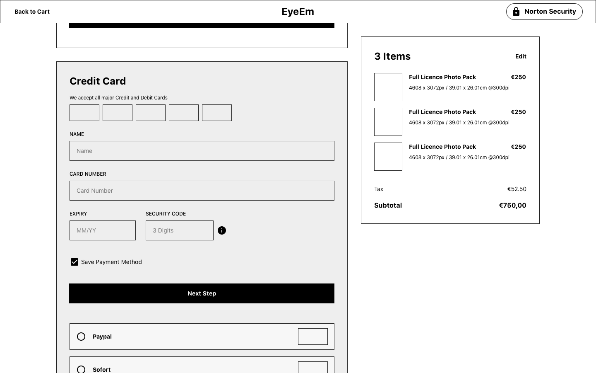
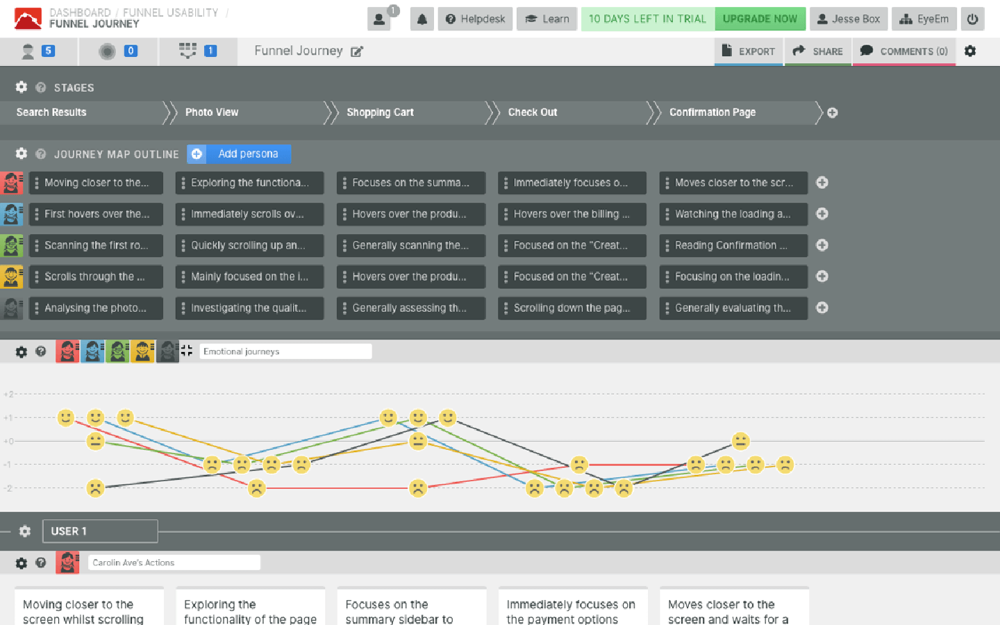
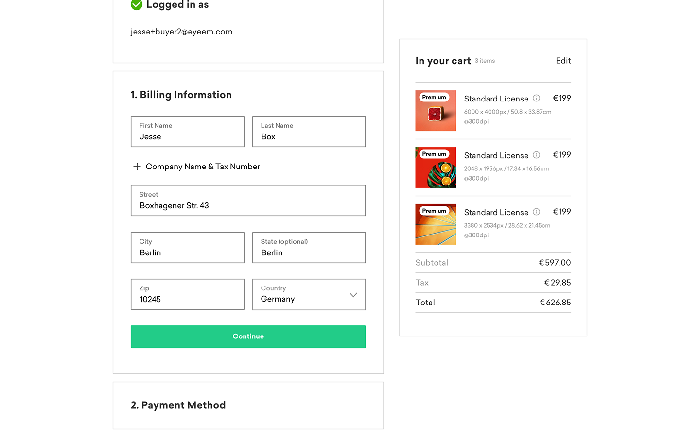

In August 2018, when I started working at EyeEm, I was at a stage in my career where the benefits of adopting the Human-centered design principles were obvious. Still, I lacked hands-on experience gathering insights from users. Up until now, it's been my focus to learn and practise research methods to better understand the problems of EyeEm users.

With every project, before I start doodling UI, I'll engage in a healthy research phase to verify what the real problem might be with each project. I regularly conduct competitive benchmarks, user journey audits and usability tests to groom my assumptions on project problems quickly. After spending a lot of time moving away from my beliefs on how to solve a user's experience, I realised that encapsulating most of the research exercises within the timeline of a project is severely hurting a teams chances of understanding critical issues.

It hurts your team's chances because it basically confirms the project problem, which is a) correct and b) very important to act on. Metaphorically speaking it feels a little like you're a horse with blinders on, and your task is to gallop to the finish line as quickly as possible.

###### Wireframe concept for the checkout page (tap to enlarge)

In the post using my own work as an example, I will take you through the process of how feature development looks like when you lack the right data at the right time. The work I will be presenting here came from a project which improved the conversion rate of EyeEm's checkout experience. For those unaware of what [EyeEm](https://www.eyeem.com/) does, we enable photographers to sell their work through our marketplace or our partners.

## Place your bets

Before a project starts, there has to be a stage in which you investigate data sources to identify potential issues with your service. In EyeEm's case, we spend most of our time looking at event tracking data which helps us to understand what users are doing on our services. Unfortunately, event tracking data doesn't allow us to know why they are making these decisions, leaving us to speculate. Speculating why your users behave in a certain way is not good practice, but at the end of the day, you've got to make a timely decision that best serves the interests of your company.

Why we focused on improving the EyeEm's checkout experience in the first place was because we simply weren't close to reaching our revenue goals. You might be thinking "Hang on, there could be several issues not related to checkout which attribute to less-than-expected revenue, why start there?". When reviewing our event tracking data, we saw two things. While the majority of people dropped off when browsing for photos, there was still a lot of remaining people accessing the checkout flow, which neglected to make a transaction.

If you want to improve revenue metrics, it seems like the safest bet is to target the area of your service where the users intent is pretty straightforward — buy a photo.

###### Our usability study using [Smaply](https://www.smaply.com/) (tap to enlarge)

Making bets aside, to further our understanding of checkout experiences, we conducted usability studies with our colleagues, synthesised additional data and summarised other studies conducted from research institutes such as [Nielsen Norman Group](https://www.nngroup.com/) and [Baymard Institute](https://baymard.com/).

In the end, the bets we made for the checkout were:

1. Enable transactions to be made from all across the globe.
2. Add more payment methods for our new international audience.
3. Remove our signup step for potential buyers, and
4. Improve the user interface to remove as much mental friction during the checkout process.

## Did we win?

I think we made the best decisions we could have made for the checkout, but we only saw modest success from it, and that's the problem. Our team could comfortably say "job well done", but we couldn't tell you if users really wanted an improved checkout experience in the first place.

In my view, a user getting to know a service will evaluate 3 things.

1. Does this service solve the problems I experience?
2. Does this service solve them well? and
3. Does this service solve the problems in a way that I personally resonate with?

Often times making safe bets means you're struggling to meet point two on this list. Safe bets often lead to small wins, and after a while, if your building products, you'll probably start to wonder when the sum of these wins will add up to any considerable milestone.

## What's happens now?

At the start of this post, I explained that Human-Centered design principles motivated me to learn and practise methods of user research. Through that process, I drew a conclusion that user research shouldn't only be conducted within the timeline of the project and that methods revealing how users make decisions will keep us focused on what really matters to them.

###### Screenshot of our checkout in production (tap to enlarge)

But there's more to product development than just process and experience. I work with a lot of super-smart people, and every one of them has to deal with a lot of things on any given day. There are simply so many factors that can affect your overall output of work that it wouldn't be fair to generalise. You might be under pressure to complete a task, juggling too many projects at once or lack the proper resources to do your job right. On top of that, everyone has their views on how to approach challenges, so while I might take issue with something, another person can disagree. That's the nature of working with people with the same goal; you just have to find the right way to move forward together even if the collaboration isn't perfect.

We made the changes to the checkout in early 2019, ancient history by product standards, but it's a project that still sticks with me to this day. It's not about the design, it's about how good work can lead to less than expected results because the team isn't adequately informed. I can't say right now what's the next best step is, because maybe my opinions are entirely wrong, but regardless I can't see any harm investing in the process and methods of which we gather feedback from our users.

<YouTube youTubeId="rmM0kRf8Dbk" />{" "}

I'll leave you with this video featuring Don norman sharing his approach to "Human-Centered Design" because at the end of the day I'm just repeating what he's been saying for the past 30 years.
